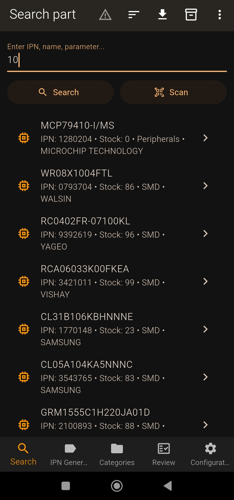
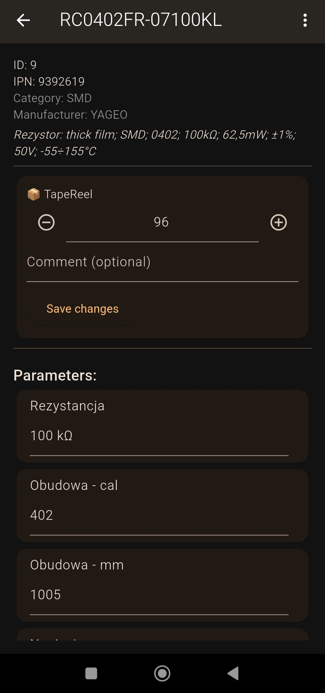
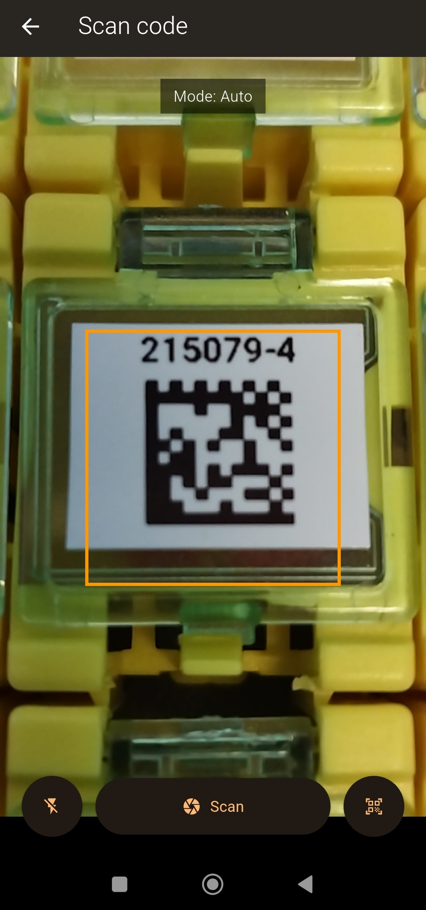
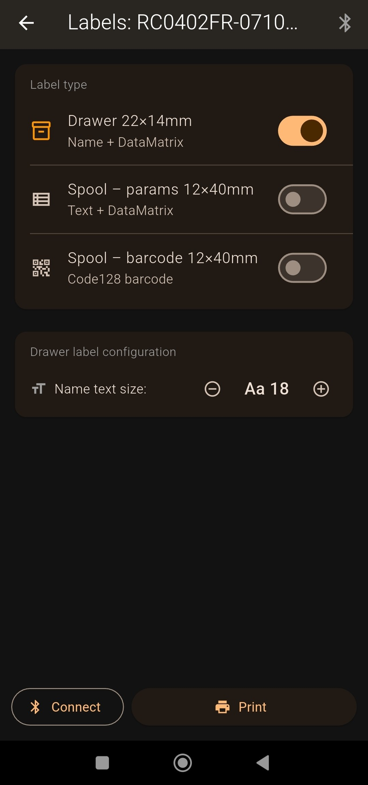
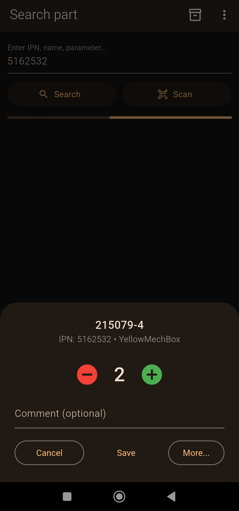
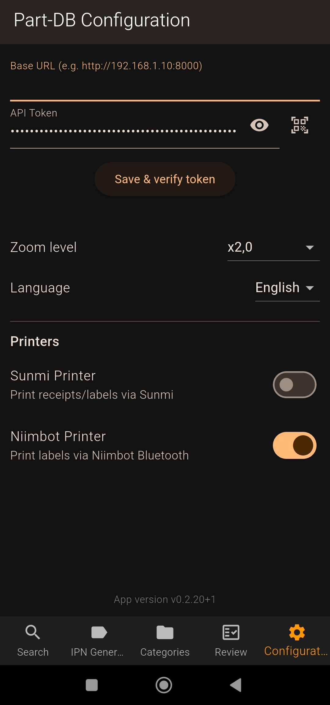
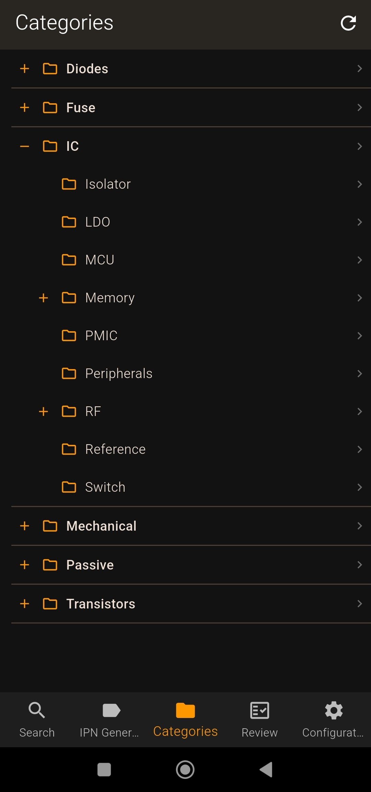
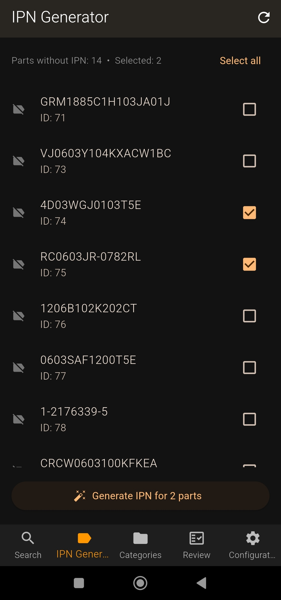
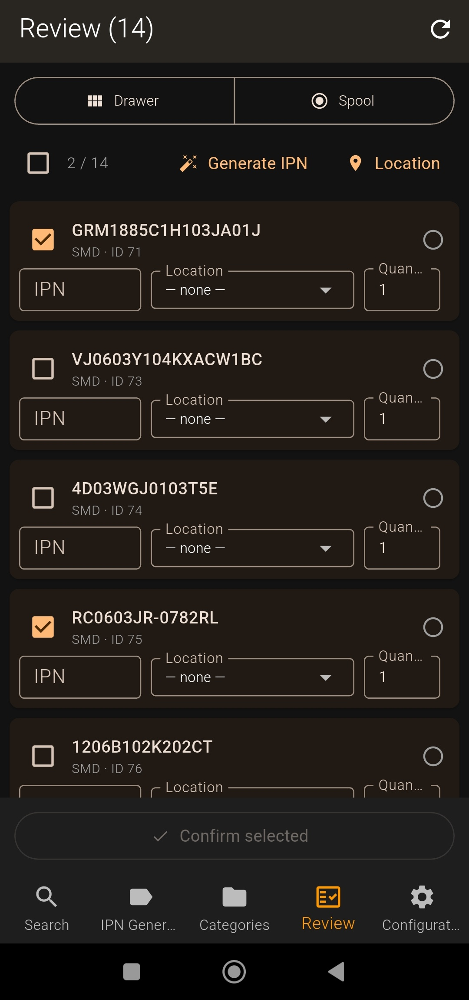

# PartDB Scanner

Android mobile app for electronics inventory management, built with Flutter. Connects to a self-hosted [Part-DB](https://github.com/Part-DB/Part-DB-server) server via REST API and extends it with barcode scanning, Niimbot BLE label printing, and Sunmi thermal printing.


> **Sister app:** [partdb_label_printer](https://github.com/bartkepl/partdb_label_printer) — Windows desktop app for Zebra label printing.

---

## Screenshots

| Search | Part detail |
|---|---|
|  |  |

| Scanning | Niimbot label printing |
|---|---|
|  |  |

| Quick stock update (after scan) | Configuration |
|---|---|
|  |  |

| Category browser | IPN Generator |
|---|---|
|  |  |

| Review |  |
|---|---|
|  | |

---

## Features

| Module | Description |
|---|---|
| **Search** | Find parts by name, IPN, or by scanning a QR/barcode |
| **Part detail** | View and edit stock levels, parameters, and photos |
| **IPN generator** | Bulk-generate internal part numbers for unidentified parts |
| **Category browser** | Hierarchical browsing of the Part-DB category tree |
| **Stock-taking** | Mass stock-level update mode with discrepancy detection |
| **Niimbot printing** | BLE label printing: drawer labels 22×14 mm, reel labels 12×40 mm |
| **Sunmi printing** | Print part info on the built-in Sunmi thermal printer |
| **Low-stock alerts** | Notification on startup for parts below minimum stock |
| **History** | Quick access to recently viewed parts |
| **CSV export** | Export search results via the native share dialog |
| **Language** | UI language switchable between English and Polish |

---

## Requirements

### Server

- [Part-DB](https://github.com/Part-DB/Part-DB-server) with REST API enabled (any recent version)
- A user API token with read and write permissions

### Device

- Android 6.0 (API 23) or newer
- Bluetooth Low Energy — required for Niimbot printers
- Camera — required for barcode scanning

### Optional hardware

- **Niimbot** label printer (D11, B21, B3, D101, and 70+ other models) via Bluetooth
- **Sunmi** device with a built-in thermal printer (V2, V2s, T2, and others)

---

## Installation

### Pre-built APK (recommended)

Download the latest `.apk` from the [**Releases**](../../releases) page and install it on your device. You must enable *Install from unknown sources* in Android settings.

### Build from source

1. Install [Flutter SDK](https://docs.flutter.dev/get-started/install) (required: `^3.9.2`)
2. Clone the repository:
   ```bash
   git clone https://github.com/bartkepl/partdb_scanner.git
   cd partdb_scanner
   ```
3. Fetch dependencies:
   ```bash
   flutter pub get
   ```
4. Connect an Android device or start an emulator, then build and install:
   ```bash
   flutter run --release
   ```
   Or build a standalone APK:
   ```bash
   flutter build apk --release
   # Output: build/app/outputs/flutter-apk/app-release.apk
   ```

---

## Configuration

On first launch, open the **Config** tab and fill in:

| Field | Description |
|---|---|
| **Base URL** | Part-DB server address, e.g. `http://192.168.1.10:8000` |
| **API Token** | Token generated in Part-DB (`Settings → API Tokens`). Can be scanned as a QR code. |
| **Camera zoom** | Zoom level for barcode scanning (1.0× – 3.0×) |
| **Sunmi printer** | Enable/disable Sunmi printing options |
| **Niimbot printer** | Enable/disable Niimbot label printing options |
| **Language** | Switch UI language between English (`en`) and Polish (`pl`) |

The printer toggles hide hardware options not available on your device.

---

## Label printing (Niimbot)

Three label types are configurable in the print tab:

| Label type | Size | Content |
|---|---|---|
| Drawer label | 22 × 14 mm (landscape) | Name, IPN, category |
| Reel label — parameters | 12 × 40 mm (portrait) | Name, value, package |
| Reel label — barcode | 12 × 40 mm (landscape) | Code128 barcode with IPN |

Supported printer models: D11, D101, B21, B3, A8, K3, and 70+ other Niimbot models.

---

## Project structure

```
lib/
├── main.dart                   # Entry point, navigation
├── pages/
│   ├── search_page.dart        # Part search
│   ├── part_detail_page.dart   # Part detail and editing
│   ├── category_browser_page.dart
│   ├── ipn_generator_page.dart
│   ├── label_print_page.dart   # Niimbot printing
│   ├── stock_taking_page.dart  # Stock-taking mode
│   ├── config_page.dart        # App settings
│   └── barcode_scan_page.dart
├── services/
│   ├── api_service.dart        # Part-DB REST client + config storage
│   ├── niimbot_service.dart    # Niimbot printer (BLE)
│   ├── printer_service.dart    # Sunmi printer
│   ├── export_service.dart
│   └── history_service.dart
└── models/
    ├── part.dart
    ├── label_config.dart
    └── api_exception.dart

packages/
└── niim_blue_flutter/          # Local package: Niimbot BLE protocol
```

---

## Dependencies

| Package | Version | License | Purpose |
|---|---|---|---|
| `camera` | ^0.11 | BSD-3-Clause | Camera preview for scanning |
| `google_mlkit_barcode_scanning` | ^0.14 | MIT | QR and barcode recognition |
| `sunmi_printer_plus` | ^4.1 | MIT | Sunmi thermal printer |
| `niim_blue_flutter` | local | MIT | Niimbot BLE protocol |
| `flutter_secure_storage` | ^10.0 | BSD-3-Clause | Secure token and config storage |
| `shared_preferences` | ^2.2 | BSD-3-Clause | Label preferences |
| `provider` | ^6.0 | MIT | State management |
| `http` | ^1.2 | BSD-3-Clause | Part-DB REST API client |
| `permission_handler` | ^11.3 | MIT | Bluetooth and camera permissions |
| `image_picker` | ^1.1 | Apache-2.0 | Add photos to parts |
| `share_plus` | ^10.1 | MIT | Native share dialog for CSV export |
| `barcode` | 2.2.9 | MIT | Barcode image generation |
| `path_provider` | ^2.1 | BSD-3-Clause | File paths |
| `package_info_plus` | 4.2.0 | MIT | App version info |

> **Note:** [Part-DB server](https://github.com/Part-DB/Part-DB-server) is licensed under **AGPL-3.0**.
> This app communicates with Part-DB exclusively via its public REST API and is not a derivative work.
> All direct dependencies use permissive licenses (MIT, BSD-3-Clause, Apache-2.0) compatible with MIT.

---

## License

This project is available under the [MIT License](LICENSE).
