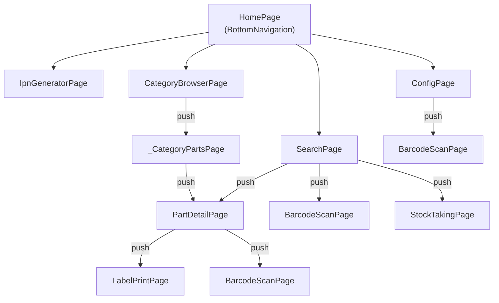
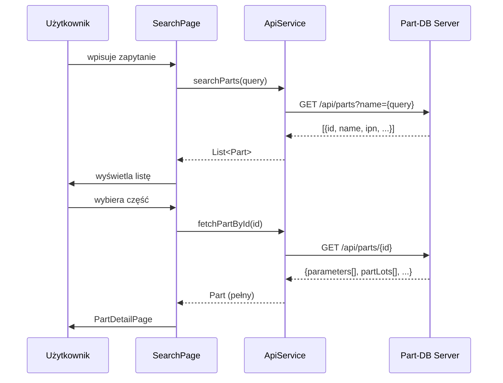

# Architektura aplikacji

## Struktura projektu

```
lib/
├── main.dart                  # Punkt wejścia, konfiguracja motywu, bottom nav
├── models/
│   ├── part.dart              # Part, PartLot, PartParameter
│   ├── api_exception.dart     # Wyjątek API z kodem HTTP
│   └── label_config.dart      # Konfiguracja etykiet Niimbot
├── pages/
│   ├── search_page.dart       # Główny ekran wyszukiwania
│   ├── barcode_scan_page.dart # Kamera + ML Kit
│   ├── part_detail_page.dart  # Szczegóły i edycja części
│   ├── ipn_generator_page.dart# Generator IPN
│   ├── category_browser_page.dart # Drzewo kategorii
│   ├── config_page.dart       # Konfiguracja serwera
│   ├── label_print_page.dart  # Drukowanie Niimbot
│   └── stock_taking_page.dart # Inwentaryzacja
└── services/
    ├── api_service.dart        # Klient REST Part-DB
    ├── history_service.dart    # Historia ostatnio oglądanych
    ├── export_service.dart     # Eksport CSV
    ├── printer_service.dart    # Drukarka Sunmi
    ├── printer_controller.dart # Abstrakcja Sunmi
    └── niimbot_service.dart    # Drukarka Niimbot D101
```

---

## Wzorzec architektoniczny

Aplikacja używa wzorca **Provider** do zarządzania stanem i wstrzykiwania zależności.

```
main.dart
└── MultiProvider
    └── Provider<ApiService>        # Singleton klienta API
        └── MaterialApp
            └── HomePage (StatefulWidget)
                └── BottomNavigationBar
                    ├── SearchPage
                    ├── IpnGeneratorPage
                    ├── CategoryBrowserPage
                    └── ConfigPage
```

Każdy ekran jest niezależnym `StatefulWidget` i odczytuje `ApiService` z kontekstu przez `Provider.of<ApiService>(context)`.

---

## Graf nawigacji



!!! note
    `BarcodeScanPage` zwraca wynik przez `Navigator.pop(context, result)`. Wywoływana jest z trzech różnych miejsc z różnymi kontekstami użycia (wyszukiwanie IPN, skanowanie tokenu, skanowanie w inwentaryzacji).

---

## Przepływ danych



---

## Serwisy

### ApiService

Centralny klient HTTP dla Part-DB API. Przechowuje konfigurację (URL, token) w **Flutter Secure Storage** – dane są zaszyfrowane kluczem sprzętowym Android Keystore.

Kluczowe metody:

| Metoda | Opis |
|--------|------|
| `searchParts(query)` | Wyszukiwanie wielotryb (IPN, nazwa, parametr, wartość, auto) |
| `fetchPartById(id)` | Pełne dane części z parametrami i partiami |
| `fetchAllParts()` | Stronicowany pobór wszystkich części (max 2000) |
| `patchPartLot(id, amount)` | Aktualizacja ilości w lokalizacji |
| `patchPartParameter(id, value)` | Aktualizacja wartości parametru |
| `patchPartIpn(id, ipn)` | Nadanie IPN do części |
| `fetchCategories()` | Drzewo kategorii (max 200, paginacja) |
| `uploadAttachment(partId, bytes)` | Przesłanie zdjęcia jako base64 |

Timeout standardowy: **10 s**, dla uploadu pliku: **30 s**.

### HistoryService

Przechowuje ostatnie **20** przeglądanych części w `SharedPreferences` jako JSON. Używany przez `SearchPage` do wyświetlenia historii przy pustym polu wyszukiwania.

### ExportService

Generuje plik CSV z wyników wyszukiwania (ID, IPN, Nazwa, Stan, Min, Kategoria, Producent, Opis) i udostępnia go przez natywny dialog `share_plus`.

### NiimbotService

Generuje bitmapy etykiet za pomocą `dart:ui` Canvas API i przesyła je przez Bluetooth do drukarki Niimbot D101. Obsługuje trzy typy etykiet: szufladkową (22×14 mm) i dwa warianty szpulowe (12×40 mm).

### PrinterService / PrinterController

Abstrakcja nad `SunmiPrinterPlus` do drukowania paragonów termicznych na urządzeniach Sunmi. Formatuje dane części (nazwa, IPN, parametry, lokalizacje, kod QR).

---

## Przechowywanie danych lokalnych

| Dane | Mechanizm | Klucz |
|------|-----------|-------|
| Adres serwera | Flutter Secure Storage | `partdb_base_url` |
| Token API | Flutter Secure Storage | `partdb_token` |
| Zoom kamery | Flutter Secure Storage | `camera_zoom` |
| Historia części | SharedPreferences (JSON) | `part_history` |
| Konfiguracja etykiet | SharedPreferences (JSON) | `niimbot_label_params` |

---

## Motyw

Material 3, tryb ciemny, kolor dominujący: **Deep Orange** (`#FF9800`). Tryb ciemny jest domyślny i jedyny dostępny (`ThemeMode.dark`).

---

## Zależności kluczowe

| Pakiet | Wersja | Rola |
|--------|--------|------|
| `flutter` | SDK ^3.9.2 | Framework UI |
| `provider` | ^6.0.5 | Wstrzykiwanie zależności / state management |
| `http` | ^1.2.2 | Klient REST |
| `flutter_secure_storage` | ^10.0.0 | Szyfrowane przechowywanie tokenu |
| `shared_preferences` | ^2.2.3 | Lokalna historia i konfiguracja |
| `camera` | ^0.11.0+2 | Podgląd kamery |
| `google_mlkit_barcode_scanning` | ^0.14.2 | Detekcja kodów kreskowych |
| `niim_blue_flutter` | ^1.0.0 | Drukarka Niimbot (Bluetooth) |
| `sunmi_printer_plus` | ^4.1.1 | Drukarka Sunmi |
| `barcode` | 2.2.9 | Generowanie Data Matrix / Code128 |
| `share_plus` | ^10.1.2 | Eksport CSV |
| `image_picker` | ^1.1.2 | Wybór zdjęcia do załącznika |
