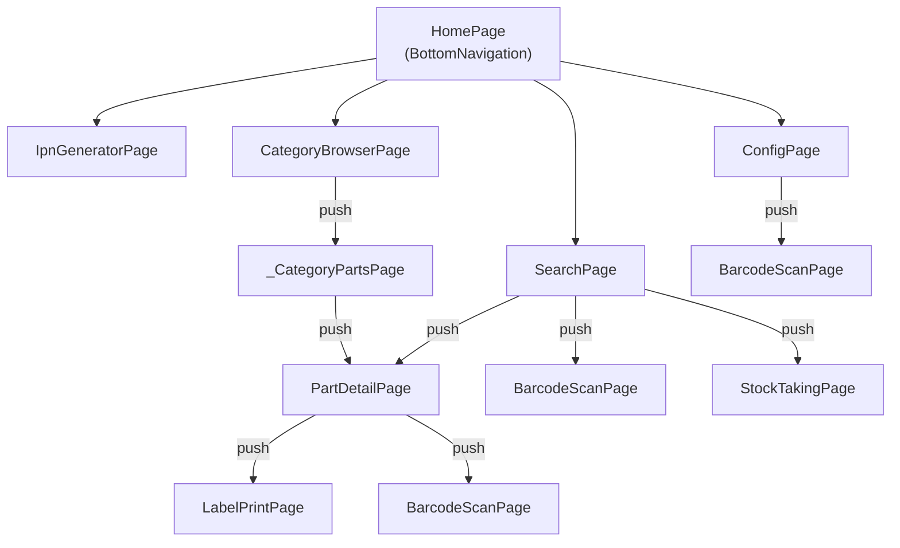
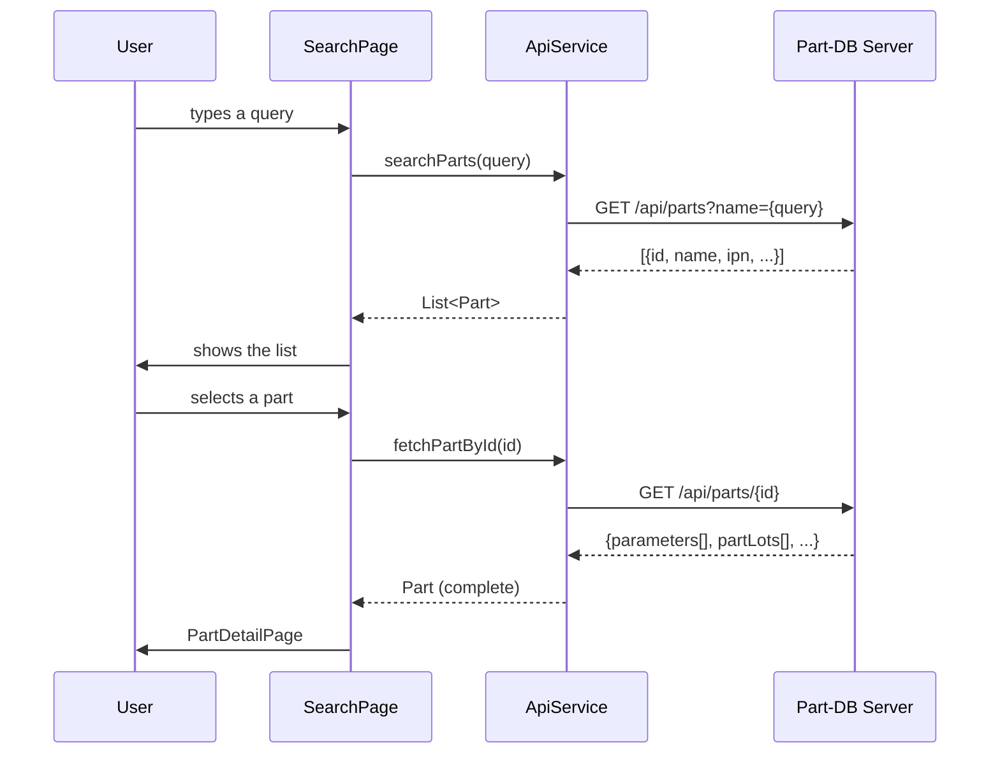

# App architecture

## Project structure

```
lib/
├── main.dart                  # Entry point, theme config, bottom nav
├── models/
│   ├── part.dart              # Part, PartLot, PartParameter
│   ├── api_exception.dart     # API exception with HTTP code
│   └── label_config.dart      # Niimbot label configuration
├── pages/
│   ├── search_page.dart       # Main search screen
│   ├── barcode_scan_page.dart # Camera + ML Kit
│   ├── part_detail_page.dart  # Part details and editing
│   ├── ipn_generator_page.dart# IPN generator
│   ├── category_browser_page.dart # Category tree
│   ├── config_page.dart       # Server configuration
│   ├── label_print_page.dart  # Niimbot printing
│   └── stock_taking_page.dart # Stock taking
└── services/
    ├── api_service.dart        # Part-DB REST client
    ├── history_service.dart    # Recently viewed history
    ├── export_service.dart     # CSV export
    ├── printer_service.dart    # Sunmi printer
    ├── printer_controller.dart # Sunmi abstraction
    └── niimbot_service.dart    # Niimbot D101 printer
```

---

## Architectural pattern

The app uses the **Provider** pattern for state management and dependency injection.

```
main.dart
└── MultiProvider
    └── Provider<ApiService>        # API client singleton
        └── MaterialApp
            └── HomePage (StatefulWidget)
                └── BottomNavigationBar
                    ├── SearchPage
                    ├── IpnGeneratorPage
                    ├── CategoryBrowserPage
                    └── ConfigPage
```

Each screen is an independent `StatefulWidget` and reads `ApiService` from the context through `Provider.of<ApiService>(context)`.

---

## Navigation graph



!!! note
    `BarcodeScanPage` returns its result via `Navigator.pop(context, result)`. It is called from three different places with different use contexts (IPN search, token scanning, stock-taking scanning).

---

## Data flow



---

## Services

### ApiService

The central HTTP client for the Part-DB API. It keeps the configuration (URL, token) in **Flutter Secure Storage** – the data is encrypted with a hardware key in the Android Keystore.

Key methods:

| Method | Description |
|--------|-------------|
| `searchParts(query)` | Multi-mode search (IPN, name, parameter, value, auto) |
| `fetchPartById(id)` | Full part data with parameters and lots |
| `fetchAllParts()` | Paginated fetch of all parts (max 2000) |
| `patchPartLot(id, amount)` | Update the quantity at a location |
| `patchPartParameter(id, value)` | Update a parameter value |
| `patchPartIpn(id, ipn)` | Assign an IPN to a part |
| `fetchCategories()` | Category tree (max 200, paginated) |
| `uploadAttachment(partId, bytes)` | Upload a photo as base64 |

Standard timeout: **10 s**, for file upload: **30 s**.

### HistoryService

Stores the last **20** viewed parts in `SharedPreferences` as JSON. Used by `SearchPage` to show history when the search field is empty.

### ExportService

Generates a CSV file from the search results (ID, IPN, Name, Stock, Min, Category, Manufacturer, Description) and shares it through the native `share_plus` dialog.

### NiimbotService

Generates label bitmaps using the `dart:ui` Canvas API and sends them over Bluetooth to the Niimbot D101 printer. Supports three label types: drawer (22×14 mm) and two reel variants (12×40 mm).

### PrinterService / PrinterController

An abstraction over `SunmiPrinterPlus` for printing thermal receipts on Sunmi devices. It formats the part data (name, IPN, parameters, locations, QR code).

---

## Local data storage

| Data | Mechanism | Key |
|------|-----------|-----|
| Server address | Flutter Secure Storage | `partdb_base_url` |
| API token | Flutter Secure Storage | `partdb_token` |
| Camera zoom | Flutter Secure Storage | `camera_zoom` |
| Part history | SharedPreferences (JSON) | `part_history` |
| Label configuration | SharedPreferences (JSON) | `niimbot_label_params` |

---

## Theme

Material 3, dark mode, primary color: **Deep Orange** (`#FF9800`). Dark mode is the default and the only available option (`ThemeMode.dark`).

---

## Key dependencies

| Package | Version | Role |
|---------|---------|------|
| `flutter` | SDK ^3.9.2 | UI framework |
| `provider` | ^6.0.5 | Dependency injection / state management |
| `http` | ^1.2.2 | REST client |
| `flutter_secure_storage` | ^10.0.0 | Encrypted token storage |
| `shared_preferences` | ^2.2.3 | Local history and configuration |
| `camera` | ^0.11.0+2 | Camera preview |
| `google_mlkit_barcode_scanning` | ^0.14.2 | Barcode detection |
| `niim_blue_flutter` | ^1.0.0 | Niimbot printer (Bluetooth) |
| `sunmi_printer_plus` | ^4.1.1 | Sunmi printer |
| `barcode` | 2.2.9 | Data Matrix / Code128 generation |
| `share_plus` | ^10.1.2 | CSV export |
| `image_picker` | ^1.1.2 | Photo selection for attachments |
