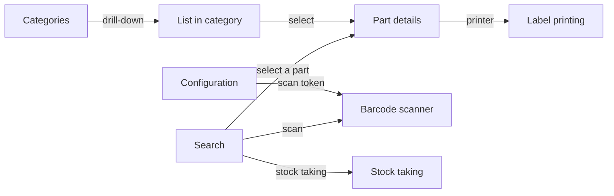

# App screens

The app is built around four main tabs available from the bottom navigation bar:

| Icon | Tab | Description |
|------|-----|-------------|
| Magnifier | **Search** | Main screen – search, scan, results list |
| Magic wand | **IPN generator** | Bulk-assign IPN identifiers |
| Tree | **Categories** | Hierarchical category browsing |
| Gear | **Configuration** | Server, token and camera settings |

A warning badge on the search tab signals that at least one part is below its minimum stock.

---

## Screen overview

---

## Detailed descriptions

- [Search](search.md) – searching, scanning, history, CSV export
- [Part details](part-detail.md) – stock, parameters, printing, photos
- [Category browser](category-browser.md) – tree, drill-down
- [IPN generator](ipn-generator.md) – generating and assigning IPNs
- [Stock taking](stock-taking.md) – scanning + stock corrections
- [Label printing](label-print.md) – Niimbot D101, label types
- [Configuration](config.md) – server, token, zoom
