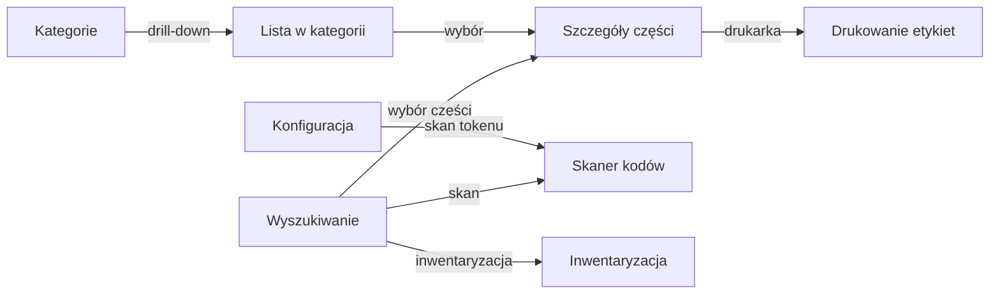

# Ekrany aplikacji

Aplikacja zbudowana jest wokół czterech głównych zakładek dostępnych z dolnego paska nawigacji:

| Ikona | Zakładka | Opis |
|-------|----------|------|
| Lupa | **Wyszukiwanie** | Główny ekran – szukanie, skanowanie, lista wyników |
| Magiczna różdżka | **Generator IPN** | Masowe nadawanie identyfikatorów IPN |
| Drzewo | **Kategorie** | Hierarchiczne przeglądanie kategorii |
| Koło zębate | **Konfiguracja** | Ustawienia serwera, tokenu i kamery |

Ikona ostrzegawcza (badge) przy zakładce wyszukiwania sygnalizuje, że co najmniej jedna część ma stan niższy niż minimum.

---

## Przegląd ekranów

---

## Szczegółowe opisy

- [Wyszukiwanie](search.md) – wyszukiwanie, skanowanie, historia, eksport CSV
- [Szczegóły części](part-detail.md) – stany, parametry, drukowanie, zdjęcia
- [Przeglądarka kategorii](category-browser.md) – drzewo, drill-down
- [Generator IPN](ipn-generator.md) – losowanie i przypisywanie IPN
- [Inwentaryzacja](stock-taking.md) – skanowanie + korekty stanów
- [Drukowanie etykiet](label-print.md) – Niimbot D101, typy etykiet
- [Konfiguracja](config.md) – serwer, token, zoom
